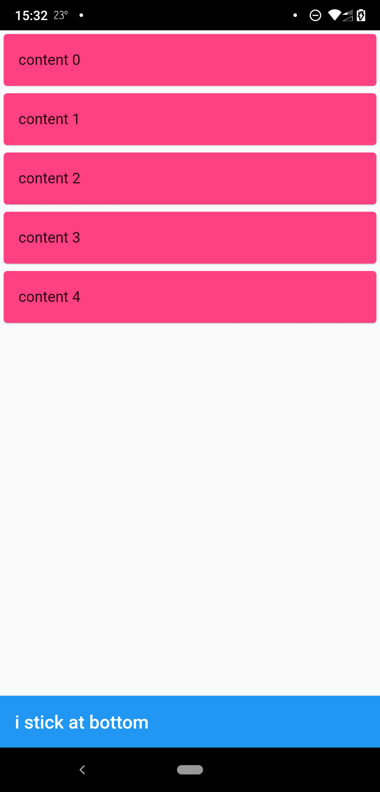
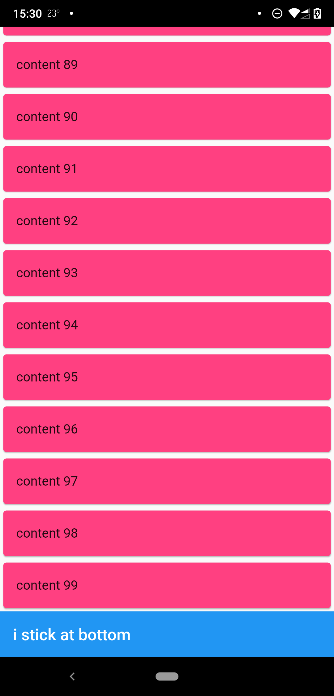

# sticky_footer_scrollview
[](https://pub.dev/packages/sticky_footer_scrollview)


A Flutter Widget that is scrollable with a sticky footer either stick to the bottom of screen of the end of the scroll body.

## Background

This package using SingleScrollView and CustomMultiChildLayout to acheive a scrollable widget with a sticky footer. This allow a dynamic height of child widgets in scroll body. 

At the same time, because of the SingleScrollView with Column approach, this is not recommended to use with lots of child widgets for performance reason. You may simiply test with the example to see whether it is fit for your case. 

## Usage

This shows Widget's full customizations:

```
StickyFooterScrollView({    
    this.footer,
    @required this.itemBuilder,
    @required this.itemCount,
    this.scrollController,
})
```

1. footer is the footer widget that is placed either at the bottom of screen or the end of the scroll body.
2. itemBuilder to build child widgets of scroll body
3. itemCount is the nunber of child widgets in scroll body. Only allows >= 0.
4. scrollController allows maunally jump to certain offset position.

## Example




```
@override
  Widget build(BuildContext context) {
    return SafeArea(
      child: Scaffold(
        body: StickyFooterScrollView(
          itemCount: 50,
          itemBuilder: (context, index) {
            return Card(
              child: ListTile(
                title: Text('content $index'),
              ),
              color: Colors.pinkAccent,
            );
          },
          footer: AppBar(
            title: Text('i stick at bottom'),
          ),
        ),
      ),
    );
  }
```


## Lisence

MIT